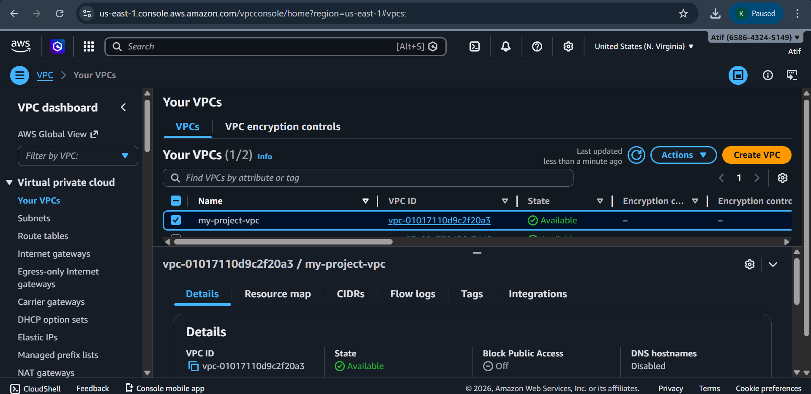
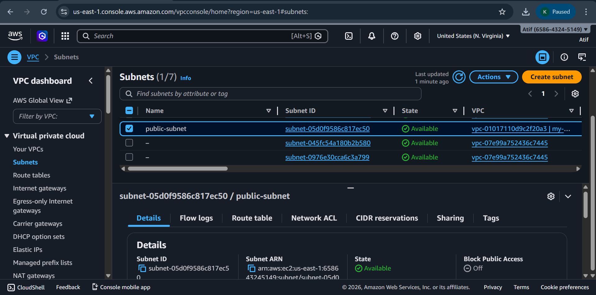
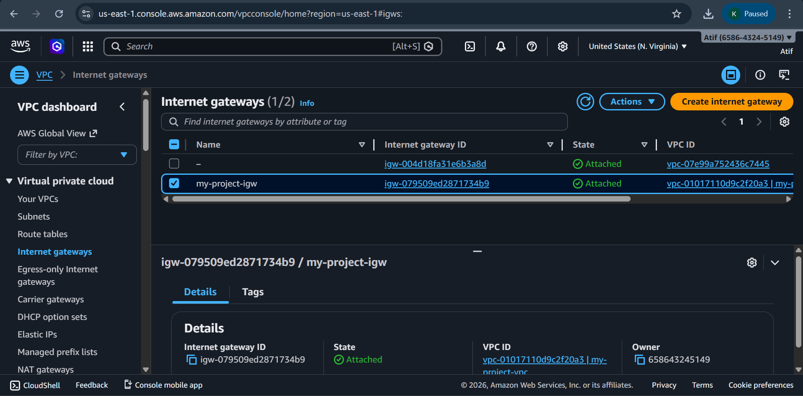
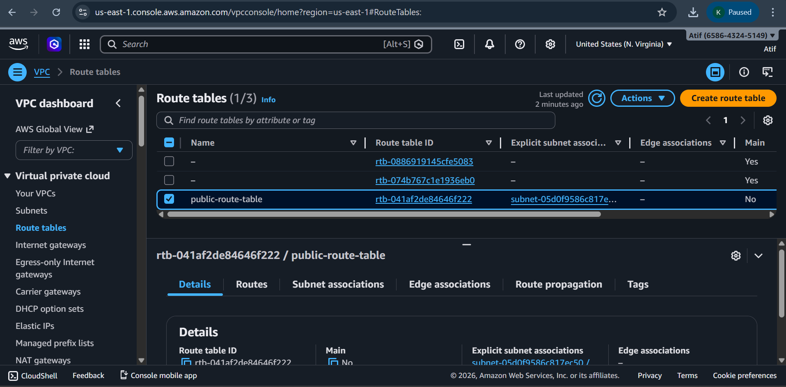
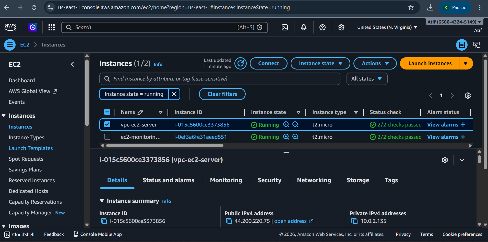
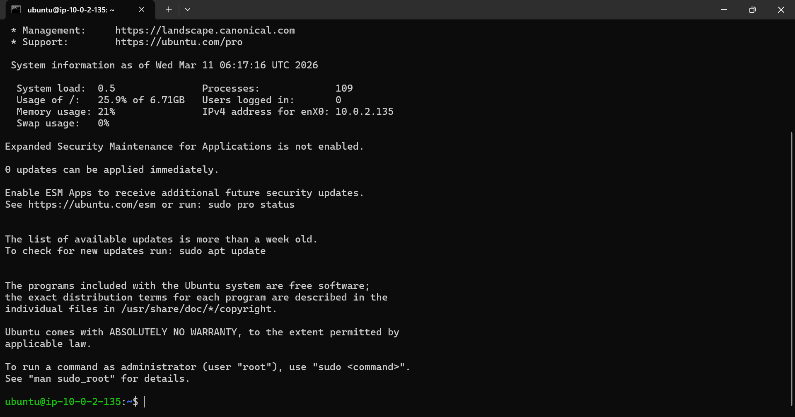

# AWS VPC + EC2 Networking Project

## Project Overview

This project demonstrates how to build a basic networking infrastructure in AWS using VPC and launch an EC2 instance inside it.

The project includes creating a VPC, subnet, internet gateway, route table configuration, and connecting to an EC2 instance using SSH.

This project helps understand AWS networking concepts used in real cloud environments.

## Technologies Used

- Amazon Web Services (AWS)
- Amazon VPC
- Amazon EC2
- Linux
- SSH

## Project Architecture

VPC → Subnet → Internet Gateway → Route Table → EC2 Instance → SSH Connection

## Implementation Steps

### 1. Create VPC

Created a Virtual Private Cloud with CIDR block.

Example:

10.0.0.0/16

### 2. Create Subnet

Created a public subnet inside the VPC.

Example:

10.0.1.0/24

### 3. Create Internet Gateway

Created an Internet Gateway and attached it to the VPC to allow internet access.

### 4. Configure Route Table

Added a route to allow internet traffic.

Destination:

0.0.0.0/0

Target:

Internet Gateway

### 5. Launch EC2 Instance

Launched an EC2 instance inside the subnet.

Instance type:

t2.micro

Operating System:

Ubuntu

### 6. Connect to EC2 via SSH

Connected to the EC2 instance using SSH from local terminal.

Command used:

ssh -i "key.pem" ubuntu@public-ip

## Project Screenshots

### VPC Created

### Subnet Created

### Internet Gateway Attached

### Route Table Configuration

### EC2 Instance Running

### SSH Connection from Terminal

## Key Learning

- Understanding AWS networking
- Creating VPC and subnet
- Configuring internet gateway
- Managing route tables
- Launching EC2 inside VPC
- Accessing servers via SSH

## Author

Atif 

Role: Cloud Support / DevOps Learner
